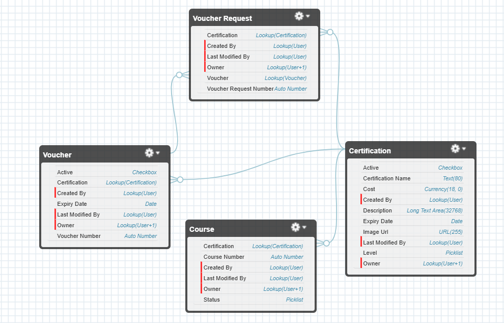
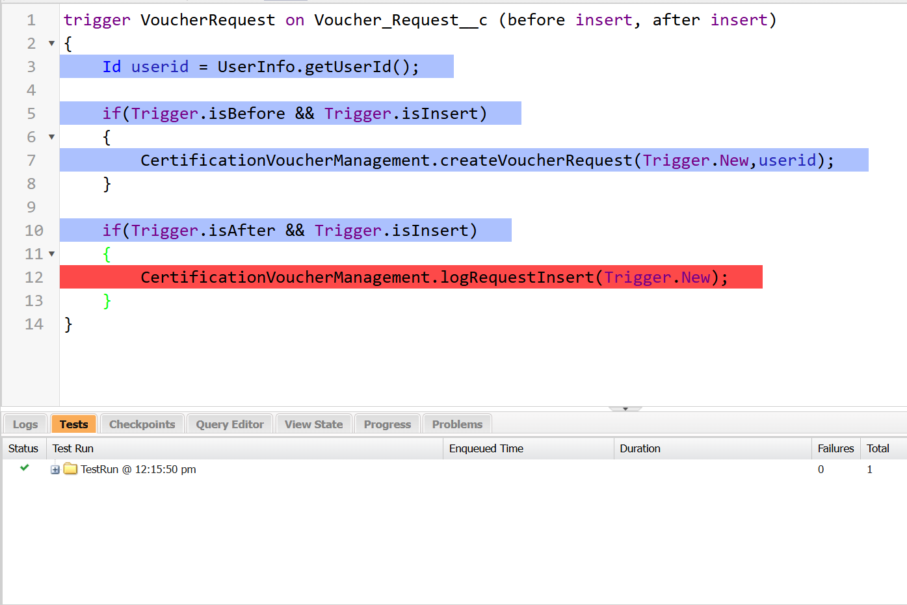

# <p align='center'>Apex Assignment 2025</p>

## Data Model



## Trigger Logic with Exception Handling

 **Certification Voucher Request** can be raised by the User/Student only if the following conditions are satisfied:

- User/Student has completed the course.
- Active Voucher is available for the requested Certification.

### Trigger

```JAVA
trigger VoucherRequest on Voucher_Request__c (before insert, after insert) 
{
    Id userid = UserInfo.getUserId();
    
	if(Trigger.isBefore && Trigger.isInsert)
    {
        CertificationVoucherManagement.createVoucherRequest(Trigger.New,userid);
    }
}

```

### Handler Class Method

- Prevented using SOQL and DML operations within loop to avoid **Governer Limitations**.
- Used **try-catch** for exception handling.

```Java
public static void createVoucherRequest(List<Voucher_Request__c> vrlist,Id curUserId)
{
    try
    {
        Set<Id> certIdList = new Set<Id>();
    
        for(Voucher_Request__c vr: vrlist)
        {
            certIdList.add(vr.Certification__c);
        }
        
        List<Course__c> cList = [Select Id,Certification__c from Course__c where CreatedById =:curUserId 
                                    AND Certification__c IN :certIdList AND Status__c = 'Completed'];
        
        List<Voucher__c> vList = [Select Id,Certification__c from Voucher__c where Certification__c IN :certIdList 
                                    AND Active__c=true];
        
        Set<Id> certCourseMap = new Set<Id>();
        Map<Id,Voucher__c> certVoucherMap = new Map<Id,Voucher__c>();
        
        for(Course__c c: cList)
        {
            certCourseMap.add(c.Certification__c);
        }
        for(Voucher__c v: vList)
        {
            certVoucherMap.put(v.Certification__c,v);
        }
        
        for(Voucher_Request__c vr: vrlist)
        {
            Id userid = vr.CreatedById;
            String errorString = '';
            
            if(!certCourseMap.contains(vr.Certification__c))
            {
                errorString += '- Course Not Completed.\n';
            }
            
            if(!certVoucherMap.containsKey(vr.Certification__c))
            {
                errorString += '- Voucher Not Available.\n';
            }
            else
            {
                vr.Voucher__r = certVoucherMap.get(vr.Certification__c);
                vr.Voucher__c = certVoucherMap.get(vr.Certification__c).Id;
            }
            
            if(errorString.length()>0)
            {
                vr.addError('Record Cannot be inserted because of the following errors:\n\n'+errorString);
            }
        }
    }
    
    catch(Exception e)
    {
        System.debug('Error: '+e.getMessage());
    }
    
}
```

## Asynchronous Apex

### Future Method

To **Log details** of newly created voucher requests

```Java
public static void logRequestInsert(List<Voucher_Request__c> vrlist)
{
    for(Voucher_Request__c vr: vrlist)
    {
        logMethod('New Voucher Request created. Here are the following details:'+
                                    '\nName: '+vr.Name+'\nCertification: '+vr.Certification__r.Name);
    }
    
}
    
@future
public static void logMethod(String msg)
{
    System.debug(msg);
}
```

### Queueable Interface

To automatically **Update Certification Expiry Date** after the date is past.

```Java
public class UpdateCertificationExpiryDate implements Queueable
{
	public void execute(QueueableContext qc)
    {
        List<Certification__c> certList = [Select Id from Certification__c where Expiry_Date__c < TODAY];
        for(Certification__c cert:certList)
        {
            cert.Expiry_Date__c = Date.today().addDays(30);
        }
        update certlist;
    }
}
```

### Schedulable Job

To **Automatically Deactivate Voucher** after expiry date is past.

```Java
public class VoucherExpiry implements Schedulable
{
	public void execute(SchedulableContext sc)
    {
        List<Voucher__c> voucherList = [Select Id from Voucher__c where Expiry_Date__c < Today];
        for(Voucher__c v: voucherList)
        {
            v.Active__c = false;
        }
        update voucherList;
    }
}
```

### Apex Test Class

To test the function of trigger and handler class



- **Code Coverage:** 80%

- Logging not tested.

```Java
@isTest
public class CertificationTesting 
{
	@isTest(SeeAllData=true)
	public static void testCreateVoucherRequest()
    {
        
        Certification__c c = [Select Id from Certification__c where Name = 'Salesforce Application Architect' LIMIT 1];
        Voucher_Request__c v = new Voucher_Request__c(Certification__r=c);
        
        Test.startTest();
        Database.SaveResult result = Database.insert(v,false);
        Test.stopTest();
        
        System.assert(!result.isSuccess());
    }
}
```

## Frontend UI


### Features:

- user details.
- courses enrolled.
- course completion status. 
- Details of the available certifications.
- Search certifications by name.

### Contoller

```Java
public with sharing class CertificationController 
{
    @AuraEnabled(cacheable=true)
    public static User getUserById(Id userid)
    {
        try
        {
            User u = [Select Id,Name,Email,Phone,Country,City from User where Id =:userid LIMIT 1];
            return u;
        }
        catch(Exception e)
        {
            System.debug('Error: '+e.getMessage());
            return null;
        }
    }

    @AuraEnabled(cacheable=true)
    public static List<Course__c> getCourseByUser(Id userId)
    {
        System.debug(userid);
		return [Select Id,Name,Status__c,Certification__r.Name,Certification__r.Description__c,Certification__r.Image_Url__c from Course__c where CreatedById =:userId];
    }

    @AuraEnabled(cacheable=true)
    public static List<Certification__c> searchCertificationByName(String n)
    {
        try
        {
            String searchString = '%'+n+'%';
        	return [Select Id,Name,Active__c,Description__c,Cost__c,Level__c,Image_Url__c from Certification__c where Name like :searchString Limit 100];
        }
        catch(Exception e)
        {
            System.debug(e.getMessage());
            return new List<Certification__c>();
        }
        
    }

    @AuraEnabled(cacheable=true)
    public static Certification__c getCertificationByName(String n)
    {
        try
        {
            return [Select Id,Name,Active__c,Description__c,Cost__c,Level__c from Certification__c where Name =:n limit 1];
        }
        catch(Exception e)
        {
            System.debug(e.getMessage());
            return null;
        }
    }

    @AuraEnabled(cacheable=true)
    public static Certification__c getCertificationById(Id certificationId)
    {	try
    	{
        	return [Select Id,Name,Active__c,Description__c,Cost__c,Level__c from Certification__c where Id=:certificationId];
    	}
     	catch(Exception e)
        {
            System.debug('Error: '+e.getMessage());
            return null;
        }
    }

    @AuraEnabled(cacheable=true)
    public static List<Certification__c> getAllCertifications()
    {
        try
        {
            return [Select Id,Name,Active__c,Description__c,Cost__c,Level__c,Image_Url__c from Certification__c Limit 100];
        }
        catch(Exception e)
        {
            System.debug(e.getMessage());
            return new List<Certification__c>();
        }
    }        
}
```

